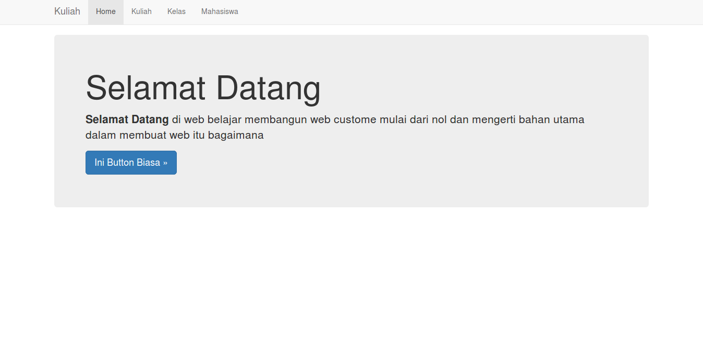
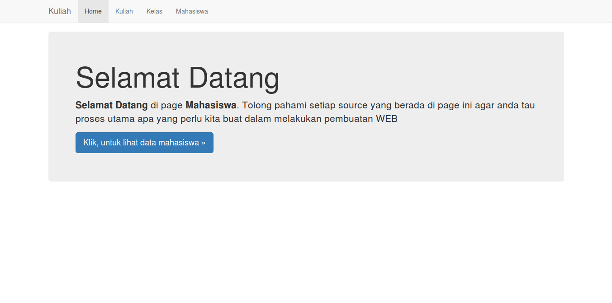
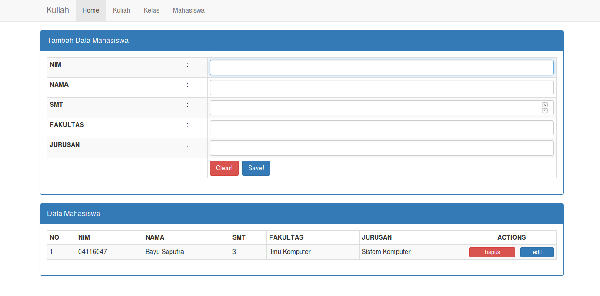

# Selamat datang
# di kelas tambahan
# pemrgraman web

### dikelas ini dimohon setiap peserta untuk mengisi pengayaan untuk mengukur tingkat kepemahaman peserta. yang nanti dijadikan sebagai indikator tingkat keberhasilan kelas ini.

perhatikan untuk merunning web.  

1. ekstrak folder ini
2. jalankan xampp, run apache & mysql
3. buka localhost/phpyadmin
4. buat database baru dengan nama kuliah
5. klik tab import lalu pilih source dan arakan ke file kuliah.sql di dalam folder DB
6. lalu run web kuliah dengan cara loclhost/kuliah

sedikit lampiran jika anda berhasil melakukan step-step diatas

diatas menunjukan home page ketika kita pertama kali buka web

diatas menunjukan home page dari content *MAHASISWA*

diatas menunjukan page input data mahasiswa

## Berikut soal pengayaannya dan tolong dibaca dengan seksama penjelasannya:

1. soal pengayaan ada di link berikut: [Soal Pengayaan](https://drive.google.com/file/d/0B1ypF4t-YzxgT0ZfVm1rcjVoU0k/view?usp=sharing)
2. buat lembar jawaban anda dari Word berupa penjelasan dan screen capture dan jadikan PDF
3. upload lembar jawaban anda di link berikut: [Tempat Upload File Jawaban](https://drive.google.com/drive/folders/0B1ypF4t-Yzxgdm51cVE3OTdSdmc?usp=sharing)

# Terimakasih
